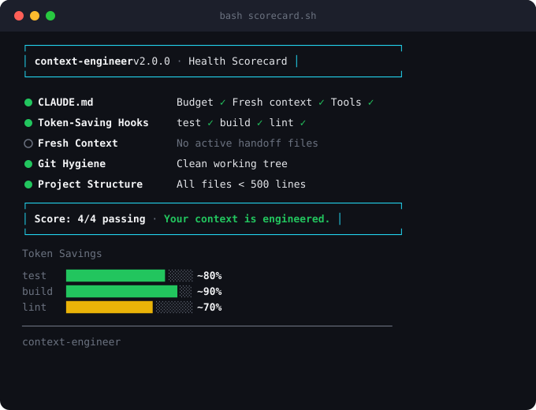

# context-engineer

Context engineering best practices for Claude Code. Budget zones, degradation detection, token-saving hooks, model switching, and more.

**10 techniques** packaged as one installable plugin — no configuration needed.

<p align="center">
  
</p>

## What It Does

| Technique | Type | Purpose |
|-----------|------|---------|
| Budget Zones | Skill | GREEN/YELLOW/ORANGE/RED context usage zones |
| Degradation Detection | Skill | Self-diagnosis when Claude starts forgetting |
| Code Intelligence | Skill (background) | Efficient tool selection for code navigation |
| Model Switching | Skill (background) | Task-to-model mapping (Haiku/Sonnet/Opus) |
| Prompt Caching | Skill (background) | Cache-friendly workflow — cache reads cost ~0.1x |
| Thinking Control | Skill (background) | Calibrated reasoning depth per task type |
| Test Output Filter | Hook | ~80% token savings on test runs |
| Build Output Filter | Hook | ~90% token savings on builds |
| Lint Output Filter | Hook | ~70% token savings on lints |
| Fresh Context Pattern | Command | TASK.md + PROGRESS.md handoff files |

## Requirements

- **macOS**, **Linux**, or **Windows** (via WSL or Git Bash — both required by Claude Code)
- `jq` (pre-installed on most dev machines; `brew install jq` / `apt install jq` if missing)

## Installation

```bash
# Add the marketplace
claude plugin marketplace add silvesterdivas/context-engineer

# Install the plugin
claude plugin install context-engineer@context-engineer-marketplace
```

Prefer the interactive UI? Run `/plugin` inside Claude Code and use the Discover and Marketplaces tabs to do the same thing.

## Updating

context-engineer is a third-party marketplace, so updates are not automatic by default. When a new version ships, refresh the marketplace and reinstall from inside Claude Code:

```
/plugin marketplace update context-engineer-marketplace
/plugin install context-engineer@context-engineer-marketplace
/reload-plugins
```

`/reload-plugins` applies the new version in your current session without a full restart. To update automatically on startup instead, run `/plugin`, open the Marketplaces tab, select context-engineer-marketplace, and toggle Enable auto-update.

## Quick Start

After installing, run the setup command to add context engineering rules to your project:

```
/context-engineer:setup
```

Then run a health check:

```
/context-engineer:diagnose
```

That's it. The background skills and hooks activate automatically.

## How to Use: New Projects

Starting fresh? Here's the complete workflow.

### Step 1: Create your project

```bash
mkdir my-new-project
cd my-new-project
git init
```

### Step 2: Run setup

Open Claude Code in your project directory and run:

```
/context-engineer:setup
```

This creates a `CLAUDE.md` in your project root with the full Context Engineering Rules section: budget zones, fresh context pattern, tool efficiency guidelines, model switching, and output filtering confirmation.

### Step 3: Run the health check

```
/context-engineer:diagnose
```

This runs a health scorecard checking 6 areas:

| Area | What It Checks |
|------|---------------|
| CLAUDE.md configuration | Rules section exists and is complete |
| Token-saving hooks | All 3 hooks installed and functional |
| MCP server hygiene | No unnecessary servers wasting tokens |
| Fresh context files | TASK.md/PROGRESS.md templates ready |
| Git hygiene | Repository is clean and well-structured |
| Project structure | Files organized for efficient AI navigation |

### Step 4: Start working

That's it. Here's what happens behind the scenes:

**When you run tests** (`npm test`):
- Before: Claude sees all 200 lines of test output (196 passed, 4 failed)
- After: Claude sees only the 4 failures + summary — **~80% token savings**

**When you run a build** (`npm run build`):
- Before: Claude reads 500 lines of webpack output
- After: Claude sees only errors and warnings — **~90% token savings**

**When you run a linter** (`npx eslint src/`):
- Before: Claude processes 150 lines of lint output
- After: Claude sees only the problems — **~70% token savings**

Hooks only activate when output exceeds 40 lines. Short outputs pass through unchanged.

### Tips for new projects

1. **Let Claude explore freely at first.** You're in GREEN zone (< 60% context). Read full files, make architecture decisions, explore freely.
2. **Use Opus for early decisions.** Model switching routes architecture decisions to Opus where it matters most.
3. **Create TASK.md early for complex features.** Run `/context-engineer:fresh-context "building the auth system"` before starting multi-session work.

---

## How to Use: Existing Projects

You have a codebase — maybe it already has a CLAUDE.md, maybe it doesn't. Context-engineer fits right in.

### Step 1: Run setup

Navigate to your project and open Claude Code:

```
/context-engineer:setup
```

- **No CLAUDE.md?** One gets created with the complete Context Engineering Rules section.
- **Existing CLAUDE.md?** The setup command reads your file and appends the rules. Your existing content stays untouched.
- **Already have the rules?** Setup detects it and skips. No duplication.

### Step 2: Audit your MCP servers

Existing projects often accumulate MCP servers over time. Each one adds token overhead:

```
/context-engineer:audit-mcp
```

You'll get a table showing each server's name, tool count, estimated token overhead, and a recommendation (keep, review, or remove).

### Step 3: Run the health check

```
/context-engineer:diagnose
```

For existing projects, pay attention to:
- **Token-saving hooks** — are they matching your build tools?
- **CLAUDE.md configuration** — did the rules integrate cleanly with your existing content?
- **Project structure** — the scorecard may flag reorganization opportunities.

### Step 4: Start working

Your workflow doesn't change. You just get dramatically better sessions.

### Tips for existing projects

1. **Your first session will feel different.** The hooks silently save thousands of tokens per test/build/lint cycle, and the budget zones now track against Claude Code's ~1M-token context window, so sessions run much longer before handoff.
2. **Watch the budget zones on large codebases.** You'll hit YELLOW and ORANGE faster because there's more code to read. The budget zone skill automatically guides Claude to be selective.
3. **Use fresh context for big refactors.** Run `/context-engineer:fresh-context "refactoring the payment module"` before starting. When context gets heavy, TASK.md and PROGRESS.md are ready for a clean handoff.
4. **Don't fight the RED zone.** When context exceeds 85%, the plugin guides Claude to wrap up. A fresh session with handoff files outperforms a degraded session every time.

---

## Understanding Budget Zones

Context usage determines how Claude behaves:

| Zone | Context Used | Behavior |
|------|-------------|----------|
| GREEN | < 60% | Full exploration. Read entire files, no constraints. |
| YELLOW | 60-75% | Selective. Prefers Grep over Read. Summarizes before processing. |
| ORANGE | 75-85% | Conservation mode. Line ranges only, targeted searches, delegates to subagents. |
| RED | > 85% | Wrap up. Finishes current task, creates TASK.md + PROGRESS.md, suggests new session. |

Percentages are measured against Claude Code's context window (~1M tokens on Opus 4.8 / Sonnet 4.6). The budget hook reads real token usage from the transcript; override the assumed window with the `CONTEXT_ENGINEER_BUDGET` environment variable. Budget zones activate automatically. No configuration needed.

---

## The Fresh Context Pattern

Complex tasks survive across sessions using handoff files.

### When to use

- A feature will take more than one session
- You're approaching ORANGE/RED zone with more work to do
- You want to hand off work to yourself tomorrow

### How it works

```
/context-engineer:fresh-context "implementing JWT authentication"
```

Creates two files:

- **TASK.md** — Goal, constraints, key files, decisions made, current context
- **PROGRESS.md** — Steps completed, current state, next steps, blockers

### Continuing in a new session

Open Claude Code in the same directory. Claude reads CLAUDE.md automatically. Then:

```
Read TASK.md and PROGRESS.md and continue where the last session left off.
```

Fresh context, full awareness, zero token baggage.

---

## Model Switching

The plugin guides Claude to use the right model for each task:

| Task Type | Model | Price (in/out per 1M) | Relative cost |
|-----------|-------|-----------------------|---------------|
| File search, grep, quick lookups | Haiku 4.5 | $1 / $5 | 1x |
| Code review, refactoring, multi-file changes | Sonnet 4.6 | $3 / $15 | ~3x |
| Architecture decisions, complex debugging, security review | Opus 4.8 | $5 / $25 | ~5x |

This works automatically through the model switching skill. Note that Opus is now ~5x Haiku (it was 25x under older pricing), so model choice is a smaller cost lever than it used to be — **prompt caching** (cache reads ~0.1x) saves far more.

---

## Degradation Detection

Four stages of context degradation with automatic detection:

| Stage | Context | Signs |
|-------|---------|-------|
| 1 | ~60% | Forgetting details, asking for re-confirmation |
| 2 | ~75% | Contradicting decisions, missing imports |
| 3 | ~85% | Hallucinating APIs, looping on same fix |
| 4 | ~90%+ | Incoherent reasoning, nonsensical code |

When degradation is detected, the skill flags it in real time so you can act before quality collapses.

---

## Daily Workflow Cheat Sheet

**Starting a session:**
1. Open Claude Code in your project — CLAUDE.md loads automatically
2. Hooks are already active — no action needed
3. Continuing previous work? "Read TASK.md and PROGRESS.md and pick up where we left off"

**During a session:**
- Tests/builds/linting are filtered automatically
- Budget zones adapt silently as context fills
- Degradation detection watches in the background
- Model switching guides subagent usage

**Ending a session:**
- Task done? Commit your code
- Task continues? Run `/context-engineer:fresh-context "remaining work"`
- Hit RED zone? Claude suggests creating handoff files automatically

**Periodic maintenance:**
- `/context-engineer:diagnose` if sessions feel slow
- `/context-engineer:audit-mcp` after adding new MCP servers
- Update CLAUDE.md if project architecture changes

---

## Troubleshooting

### Hooks don't seem to be filtering output
Hooks only activate on output exceeding 40 lines. Run a test suite with enough tests to generate verbose output.

### Setup added duplicate content to CLAUDE.md
Run `/context-engineer:diagnose` to check. The setup command checks for existing rules before adding. If duplication occurred, remove the duplicate section manually.

### Context still fills up quickly on a large codebase
Expected for large codebases. Budget zones and model switching extend your session, but use fresh context more frequently. Focus sessions on specific subsystems.

### Customizing which commands trigger hooks
Edit the hook scripts at `hooks/scripts/`. Each script has a pattern matcher at the top.

### Changing the 40-line threshold
Edit the `LINE_COUNT` check in any hook script under `hooks/scripts/`.

---

## Commands Reference

### `/context-engineer:setup`
Adds context engineering rules (budget zones, fresh context pattern, tool efficiency guidelines) to your project's CLAUDE.md.

### `/context-engineer:fresh-context "Build auth feature"`
Creates TASK.md and PROGRESS.md with current progress so you can continue in a new conversation with full context. Use when your context is getting heavy or before a complex task.

### `/context-engineer:audit-mcp`
Lists all configured MCP servers, estimates their token overhead, and flags unused ones that are wasting context space.

### `/context-engineer:diagnose`
Runs a health scorecard checking: CLAUDE.md config, hooks, MCP hygiene, fresh context files, git state, and project structure. Produces a pass/warn/fail table with specific fix recommendations. As of v1.2.0 it also prints a live session line (context size, cache-hit rate, and estimated cost per turn at Opus 4.8 rates) when an active transcript and `jq` are available.

## Skills Reference

Two kinds of skills ship with the plugin. **User-invocable** skills (Budget Zones, Degradation Detection) can be called any time. **Background** skills (Code Intelligence, Model Switching, Prompt Caching, Thinking Control) activate automatically based on what you are doing; you can also trigger one on demand by describing the situation. For example, "how do I cut token costs?" or "make this cache-friendly" activates Prompt Caching, and "which model should I use?" activates Model Switching.

### Budget Zones (user-invocable)
Defines four context usage zones — GREEN (free), YELLOW (selective), ORANGE (conserve), RED (wrap up). Activates automatically when context fills, or invoke manually to check your current zone.

### Degradation Detection (user-invocable)
Four stages of context degradation with specific signs and corrective actions. Helps Claude recognize when it's starting to forget, hallucinate, or loop.

### Code Intelligence (background)
Guides efficient tool selection: when to Grep vs Read, how to navigate imports and type hierarchies, token cost comparisons for different navigation approaches.

### Model Switching (background)
Maps task types to optimal models. Haiku for searches, Sonnet for reviews, Opus for architecture. Includes current pricing (Haiku $1/$5, Sonnet $3/$15, Opus $5/$25 per 1M) and delegation guidance.

### Prompt Caching (background)
Cache-friendly workflow guidance: caching is a prefix match, so keep CLAUDE.md and early context stable, batch edits, and avoid re-reading early files. Cache reads cost ~0.1x, the biggest token-cost lever there is.

### Thinking Control (background)
Calibrates reasoning depth: minimal for mechanical tasks, deep for security/architecture. Prevents over-thinking simple tasks and under-thinking complex ones.

## Agents Reference

### Investigator (Haiku)
Fast, cheap codebase search agent. Use via the Task tool for broad searches that would clutter your main context. Tools: Read, Grep, Glob.

### Reviewer (Sonnet)
Code review agent with fresh context. Reads code thoroughly and provides structured feedback (critical/warning/suggestion). Tools: Read, Grep, Glob, Bash (git only).

## Hooks Reference

Three PostToolUse hooks automatically filter verbose Bash output:

| Hook | Matches | Keeps | Savings |
|------|---------|-------|---------|
| `filter-test-output.sh` | jest, vitest, pytest, go test, cargo test, etc. | FAIL/ERROR lines + summary | ~80% |
| `filter-build-output.sh` | tsc, gradle, xcodebuild, cargo build, etc. | Error/warning lines | ~90% |
| `filter-lint-output.sh` | eslint, pylint, clippy, biome, etc. | Problem lines only | ~70% |

Hooks only activate on output > 40 lines. Short output passes through unfiltered.

## Customization

### Disable a specific hook
Remove the corresponding entry from `hooks/hooks.json`.

### Adjust the 40-line threshold
Edit the `LINE_COUNT` check in any script under `hooks/scripts/`.

### Add project-specific budget zone rules
Run `/context-engineer:setup` then edit the generated section in your CLAUDE.md.

### Use agents with different models
Copy the agent files to your project's `.claude/agents/` directory and modify the `model` frontmatter.

## Changelog

### v2.0.0

- **Refactor:** The three output filters (test, build, lint) now share a single sourced scaffold (`hooks/scripts/filter-common.sh`) instead of duplicating it three times. Behavior is unchanged and verified byte-for-byte.
- **New:** Filter line-count threshold is centralized and overridable via `CONTEXT_ENGINEER_FILTER_MIN_LINES` (default 30).
- **Fix:** Removed em dashes from the budget hook's zone messages to match the repo style rule.

### v1.2.1

- **Docs:** Added an Updating section with the marketplace refresh and reinstall flow, plus auto-update guidance.
- **Docs:** Documented how to invoke skills on demand, including the background Prompt Caching and Model Switching skills.
- **Docs:** Noted the v1.2.0 session-cost line in the diagnose command reference.

### v1.2.0

- **New:** Prompt Caching skill — cache-friendly workflow guidance (the biggest token-cost lever; cache reads cost ~0.1x)
- **New:** Cache-hit reporting — the budget warning hook now surfaces `% cached` in zone warnings and the RED handoff sentinel
- **New:** Session cost estimate — `/context-engineer:diagnose` and the scorecard show current context size, cache-hit rate, and estimated cost at current Opus 4.8 rates
- **Update:** Context window budget raised from 200K to ~1M to match current Claude Code (Opus 4.8 / Sonnet 4.6); now overridable via `CONTEXT_ENGINEER_BUDGET`
- **Update:** Corrected model pricing — Haiku $1/$5, Sonnet $3/$15, Opus $5/$25 per 1M (Opus is ~5x Haiku, was listed as 25x)
- **Update:** Rescaled heuristic fallback constants in the budget hook for the larger window

### v1.1.2

- **Fix:** Cap `FILE_SIZE_PCT` at 100% — previously could exceed 100, distorting composite scores
- **Fix:** Narrow compression detection to system markers only — no longer triggers on user content discussing "compressed" or "summarized" data
- **Fix:** Tighten message count grep to match JSON structure (`"role":`) instead of any `"role"` string
- **Fix:** Guard against empty transcript files in budget warning hook
- **Fix:** Atomic sentinel file creation to prevent race conditions on concurrent hook invocations
- **Fix:** Add `jq` availability check to all hook scripts — graceful exit instead of confusing errors
- **Fix:** Add `jq` error handling in filter scripts for malformed JSON input

### v1.1.1

- **Fix:** Plugin root discovery for marketplace cache installs
- **Fix:** Windows compatibility note in README

### v1.1.0

- **New:** Auto-pilot handoff system — context budget warning hook, auto-handoff skill, enhanced fresh-context templates
- **New:** Composite scoring with 4 signals (file size, message count, compression, tool density)
- **New:** Sentinel file on RED zone to trigger automatic handoff

### v1.0.0

- Initial release: budget zones, degradation detection, token-saving hooks, model switching, thinking control, code intelligence

## Credits

Built by [Silvester Divas](https://github.com/silvesterdivas). Based on 10 context engineering techniques for Claude Code.

## License

MIT
